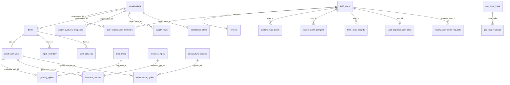

# Struttura del Database — Growa Qatar

**Ultimo aggiornamento:** Settembre 2026  
**Database:** PostgreSQL (Supabase)  
**Migrazioni:** `supabase/migrations/` (32 file, da `00001` a `00028`)

---

## 1. Panoramica

Il database di Growa Qatar è organizzato in **domini logici** che riflettono i layer della piattaforma:

| Dominio | Scopo | Tabelle principali |
|---------|-------|-------------------|
| **Identità e accesso** | Utenti, organizzazioni, ruoli, inviti | `profiles`, `organizations`, `user_organization_members` |
| **Governance** | Audit, deleghe, impersonazione, navigazione per ruolo | `audit_logs`, `role_delegations`, `user_impersonation_state`, `role_navigation` |
| **Operazioni agricole** | Farms, unità produttive, cicli, attività | `farms`, `production_units`, `growing_cycles`, `farm_activities` |
| **Riferimenti agronomici** | Cataloghi colture, bestiame, acquacoltura | `crop_types`, `gcc_crop_types`, `livestock_types`, `aquaculture_species` |
| **Mappa e intelligence** | Punti mappa, poligoni, metriche produzione | `custom_map_points`, `custom_point_polygons`, `farm_crop_insights` |
| **Supply chain** | Snapshot e flussi di approvvigionamento | `supply_overview_snapshots`, `supply_flows`, `supply_action_queue` |
| **Watchtower / Risk** | Alert operativi da segnali intelligence | `operational_alerts` |

### Fonti dati esterne (non persistite in Supabase)

| Fonte | Accesso | Contenuto |
|-------|---------|-----------|
| **Harvest API** | BFF `/api/harvest/*` | Campi, parcelle, raster satellitare, analytics |
| **Weather API** | BFF `/api/weather/*` | Osservazioni e previsioni meteo |
| **RSS** | BFF `/api/rss/feeds` | Feed notizie agricole |
| **Growa AI (Gemini)** | BFF `/api/ai/growa/*` | Interpretazione — non memorizza metriche |

I **segnali intelligence del Watchtower** (`IntelligenceSignal`) sono **calcolati a runtime** dall'API `/api/watchtower/summary` e non hanno tabella dedicata (per ora).

---

## 2. Evoluzione dello schema

Lo schema è il risultato di **due linee evolutive** che convivono:

### Schema legacy (migrazioni iniziali `00001`–`00006`, `001`–`004`)

- Modello enterprise con `country_instances`, `memberships`, `role_templates`, `departments`, `regions`
- Enum tipizzati (`organization_type`, `membership_status`, `audit_action`, ecc.)
- Pensato per governance istituzionale multi-paese

### Schema operativo unificato (migrazioni `00007`–`00028`)

- Modello pragmatico usato dall'app Next.js attuale
- `user_organization_members` con ruoli testuali (`ministry_admin`, `farm_manager`, ecc.)
- Tabelle mappa/intelligence user-scoped (`custom_map_points`, `custom_point_polygons`)
- Supply overview, alerts operativi, catalogo GCC

> **Nota:** In ambienti misti alcune tabelle legacy (`memberships`, `role_templates`) possono esistere accanto a `user_organization_members`. L'applicazione usa principalmente il modello unificato (`00017`).

---

## 3. Diagramma relazioni (domini attivi)



---

## 4. Dominio: Identità e accesso

### `profiles`

Profilo utente collegato a `auth.users`.

| Colonna | Tipo | Note |
|---------|------|------|
| `id` | UUID PK | FK → `auth.users(id)` |
| `email` | TEXT | |
| `first_name`, `last_name`, `full_name` | TEXT | Colonne di compatibilità |
| `avatar_url` | TEXT | |
| `preferred_locale`, `locale` | TEXT | Default `en` |
| `notification_preferences` | JSONB | `{ email, inApp, criticalOnly }` |
| `metadata` | JSONB | |
| `created_at`, `updated_at` | TIMESTAMPTZ | |

**RLS:** accesso al proprio profilo.

---

### `organizations`

Organizzazioni della piattaforma (ministero, aziende agricole, Hassad, ecc.).

| Colonna | Tipo | Note |
|---------|------|------|
| `id` | UUID PK | |
| `name` | TEXT | |
| `slug` | TEXT UNIQUE | |
| `description` | TEXT | |
| `type`, `organization_type` | TEXT | Sincronizzati da trigger; valori: `government_master`, `government`, `farm_company`, `public`, `private` |
| `tier` | INT | Default 1 |
| `created_at`, `updated_at` | TIMESTAMPTZ | |

**RLS:** membri dell'organizzazione possono leggere; admin possono modificare.

**RPC:** `create_organization_with_owner(org_name, org_slug, org_description, org_type)` — crea org + membership `owner`.

---

### `user_organization_members`

Associazione utente ↔ organizzazione con ruolo.

| Colonna | Tipo | Note |
|---------|------|------|
| `id` | UUID PK | |
| `user_id` | UUID FK | → `auth.users` |
| `organization_id` | UUID FK | → `organizations` |
| `role` | TEXT | Vedi elenco ruoli sotto |
| `status` | TEXT | `active`, `invited`, `inactive` |
| `invited_at`, `joined_at` | TIMESTAMPTZ | |
| UNIQUE | | `(user_id, organization_id)` |

**Ruoli supportati:**

```
owner, admin, member, viewer, editor, operator, super_admin,
ministry_officer, ministry_admin, ministry_super_admin,
sourcing_manager, supply_chain_officer, hassad_admin,
finance_officer, credit_analyst, qdb_admin,
farm_manager, agronomist, farm_company_admin, technical_support
```

**Indici:** `user_id`, `organization_id`, `role`

**RLS:** l'utente vede le proprie membership; admin org vedono tutte le membership dell'org.

---

### `organization_invite_requests`

Richieste di accesso a un'organizzazione.

| Colonna | Tipo | Note |
|---------|------|------|
| `requester_user_id` | UUID FK | |
| `requester_email` | TEXT | |
| `target_organization_id` | UUID FK | |
| `requested_role` | TEXT | `owner`, `admin`, `member` |
| `requested_farm_id` | UUID FK | Opzionale → `farms` |
| `status` | TEXT | `pending`, `approved`, `rejected`, `cancelled` |
| `note` | TEXT | |

---

## 5. Dominio: Governance e navigazione

### `role_navigation`

Configurazione menu e landing page per ruolo (fallback DB oltre al registry in codice).

| Colonna | Tipo | Note |
|---------|------|------|
| `role_name` | TEXT UNIQUE | Es. `ministry_admin` |
| `display_name` | TEXT | |
| `landing_page` | TEXT | Es. `/dashboard?module=watchtower` |
| `menu_items` | JSONB | Array di voci menu |
| `description` | TEXT | |

**RLS:** lettura per utenti autenticati.

---

### `role_delegations`

Deleghe temporanee di ruolo tra utenti della stessa organizzazione.

| Colonna | Tipo | Note |
|---------|------|------|
| `user_id` | UUID | Delegante |
| `delegated_to_user_id` | UUID | Delegato |
| `organization_id` | UUID FK | |
| `delegated_role` | TEXT | |
| `is_active` | BOOLEAN | |
| `expires_at` | TIMESTAMPTZ | Opzionale |

---

### `user_impersonation_state`

Stato impersonazione per admin Growa (`@growa.ai`).

| Colonna | Tipo | Note |
|---------|------|------|
| `user_id` | UUID PK | |
| `role_name` | TEXT | Ruolo impersonato |
| `org_id` | UUID FK | Organizzazione impersonata |
| `is_impersonating` | BOOLEAN | |

**RPC:** `get_effective_role()` — restituisce ruolo effettivo considerando impersonazione e membership.

---

### `audit_logs`

Log audit (schema compatibile legacy + nuovo).

| Colonna | Tipo | Note |
|---------|------|------|
| `user_id` / `actor_id` | UUID | |
| `organization_id` | UUID | |
| `action` | TEXT / enum | |
| `resource_type`, `resource_id` | TEXT | |
| `changes` / `metadata` | JSONB | |
| `created_at` | TIMESTAMPTZ | |

---

## 6. Dominio: Operazioni agricole

### `farms`

Registro nazionale/organizzativo delle aziende agricole.

> Esistono due definizioni storiche (`003_create_farms.sql` e `00009_operations_farms.sql`). In produzione le colonne effettive dipendono dalle migrazioni applicate. L'API `/api/operations/farms` gestisce entrambe con select progressivi.

**Colonne principali (schema esteso):**

| Colonna | Tipo | Note |
|---------|------|------|
| `id` | UUID PK | |
| `organization_id` | UUID FK | Isolamento per org |
| `code` | VARCHAR UNIQUE | Codice farm |
| `name_en`, `name_ar` / `name` | TEXT | Nome (varianti) |
| `gps_latitude`, `gps_longitude` | DECIMAL | Coordinate |
| `location`, `municipality` | TEXT | |
| `total_area_hectares`, `area_hectares` | DECIMAL | Superficie |
| `farm_type` | enum `farm_type` | `open_field`, `greenhouse`, `hydroponic`, ecc. |
| `ownership_type` | enum | `government`, `private`, ecc. |
| `status` | enum `farm_status` | `active`, `inactive`, ecc. |
| `has_irrigation`, `irrigation_type` | BOOLEAN/TEXT | |
| `created_by` | UUID | |

**Indici:** `organization_id`, `region_id`, `status`, `farm_type`

**RLS:** accesso limitato ai membri dell'organizzazione proprietaria.

---

### `production_units`

Unità operative dentro una farm (campo, capannone, vasca, ecc.).

| Colonna | Tipo | Note |
|---------|------|------|
| `farm_id` | UUID FK | |
| `code` | VARCHAR | UNIQUE per farm |
| `unit_type` | enum `production_unit_type` | `field`, `greenhouse_section`, `aquaculture_tank`, ecc. |
| `current_crop_type_id` | UUID FK | → `crop_types` |
| `status` | enum `production_unit_status` | |
| `area_sqm`, `volume_cubic_meters` | DECIMAL | |

---

### `growing_cycles`

Cicli colturali (pianificazione → raccolta).

| Colonna | Tipo | Note |
|---------|------|------|
| `production_unit_id` | UUID FK | |
| `crop_type_id` | UUID FK | |
| `planned_start_date`, `expected_harvest_date` | DATE | |
| `actual_yield_kg`, `expected_yield_kg` | DECIMAL | |
| `status` | enum `cycle_status` | `planned`, `in_progress`, `completed`, ecc. |
| `planting_method` | enum | |

---

### `livestock_batches` / `aquaculture_cycles`

Analoghi per bestiame e acquacoltura, collegati a `production_units`.

---

### `input_inventory`

Inventario input (sementi, fertilizzanti, mangimi) per farm.

| Colonna | Tipo | Note |
|---------|------|------|
| `farm_id` | UUID FK | |
| `input_type_id` | UUID FK | → `input_types` |
| `quantity_received`, `quantity_remaining` | DECIMAL | |
| `expiry_date` | DATE | |
| `status` | enum `inventory_status` | |

---

### `farm_activities`

Registro attività operative (irrigazione, concimazione, ispezione, ecc.).

| Colonna | Tipo | Note |
|---------|------|------|
| `farm_id` | UUID FK | |
| `production_unit_id` | UUID FK | Opzionale |
| `growing_cycle_id` / `livestock_batch_id` / `aquaculture_cycle_id` | UUID FK | Collegamento al ciclo |
| `activity_type` | enum `activity_type` | 25+ tipi |
| `activity_date` | DATE | |
| `inputs_used` | JSONB | |
| `weather_conditions` | JSONB | |
| `photo_urls`, `document_urls` | TEXT[] | |

---

## 7. Dominio: Cataloghi di riferimento

### `crop_types` (schema operativo esteso)

Catalogo colture con parametri agronomici per il Qatar.

| Colonna | Tipo | Note |
|---------|------|------|
| `code` | VARCHAR UNIQUE | |
| `category` | enum `crop_category` | |
| `water_requirement` | enum `water_level` | |
| `days_to_maturity` | INT | |
| `qatar_suitability_score` | INT 1–10 | |

### `gcc_crop_types` / `gcc_crop_varieties`

Catalogo GCC semplificato usato dall'UI mappa (pomodoro, cetriolo, dattero, ecc.).

| Tabella | Chiave | Note |
|---------|--------|------|
| `gcc_crop_types` | `code` TEXT PK | `name_en`, `name_ar`, `is_active` |
| `gcc_crop_varieties` | `id` UUID | FK `crop_code`, `variety_name`, `variety_key` |

**RLS:** lettura per utenti autenticati.

### `livestock_types`, `aquaculture_species`, `input_types`

Cataloghi di riferimento per il dominio operativo completo (bestiame, specie acquacoltura, input).

---

## 8. Dominio: Mappa e intelligence (core attivo)

Questo è il dominio **più usato dall'app attuale** per Water/Energy/Analytics/Watchtower.

### `custom_map_points`

Punti sulla mappa nazionale (farm, facility, sensor, custom).

| Colonna | Tipo | Note |
|---------|------|------|
| `id` | TEXT PK | Identificatore custom (non UUID) |
| `user_id` | UUID FK | Proprietario |
| `label` | TEXT | Nome visualizzato |
| `point_type` | TEXT | `custom`, `farm`, `facility`, `sensor` |
| `lat`, `lng` | DOUBLE | Coordinate |
| `external_url` | TEXT | Link esterno opzionale (migration 00027) |

**RLS:** CRUD solo sul proprio `user_id`.

---

### `custom_point_polygons`

Poligoni/parcelle disegnate su un punto mappa.

| Colonna | Tipo | Note |
|---------|------|------|
| `id` | UUID PK | |
| `user_id` | UUID FK | |
| `custom_point_id` | TEXT | FK logica → `custom_map_points.id` |
| `name` | TEXT | |
| `vertices` | JSONB | Array coordinate `[{lat, lng}, ...]` |
| `crop_name`, `crop_variety` | TEXT | |
| `sowing_date`, `expected_harvest_date` | DATE | |
| `score` | NUMERIC 0–100 | Salute colturale (NDVI proxy) |
| `estimated_production_tons` | NUMERIC | |
| `energy_consumption_kwh` | NUMERIC | |
| `water_consumption_m3` | NUMERIC | |
| `notes` | TEXT | |

**Indici:** `user_id`, `custom_point_id`

**RLS:** CRUD solo sul proprio `user_id`.

> **Nota piattaforma:** `custom_point_id` collega poligoni e insights ai punti mappa. Non esiste FK formale verso `farms.id` — il collegamento farm ↔ punto è gestito a livello applicativo.

---

### `farm_crop_insights`

Metriche di produzione/risorse aggregate per punto mappa e coltura.

| Colonna | Tipo | Note |
|---------|------|------|
| `user_id` | UUID FK | |
| `custom_point_id` | TEXT | |
| `crop_name` | TEXT | |
| `estimated_production_tons` | NUMERIC | |
| `energy_consumption_kwh` | NUMERIC | |
| `water_consumption_m3` | NUMERIC | |
| `external_url` | TEXT | |
| UNIQUE | | `(user_id, custom_point_id, crop_name)` |

**Usato da:** Water Intelligence, Energy Intelligence, Data Analytics, Watchtower signals engine.

---

### `custom_crop_types`

Colture personalizzate create dall'utente (oltre al catalogo GCC).

| Colonna | Tipo | Note |
|---------|------|------|
| `user_id` | UUID FK | |
| `name`, `normalized_name` | TEXT | UNIQUE per utente |

---

## 9. Dominio: Supply chain (Food Security)

### `supply_overview_snapshots`

Snapshot giornalieri KPI supply per organizzazione.

| Colonna | Tipo | Note |
|---------|------|------|
| `organization_id` | UUID FK | |
| `snapshot_date` | DATE | UNIQUE con org |
| `available_contract_volume_tons` | NUMERIC | |
| `in_transit_tons` | NUMERIC | |
| `at_risk_deliveries_count` | INT | |
| `avg_lead_time_days` | NUMERIC | |
| `*_delta_*` | NUMERIC | Variazioni vs periodo precedente |

### `supply_flows`

Flussi commodity (origine → destinazione).

| Colonna | Tipo | Note |
|---------|------|------|
| `flow_code` | TEXT | |
| `commodity` | TEXT | |
| `origin_label`, `destination_label` | TEXT | |
| `status` | TEXT | `on-track`, `watch`, `risk` |
| `eta_label` | TEXT | |
| `priority` | INT | |

### `supply_action_queue`

Azioni operative aperte per il team supply.

| Colonna | Tipo | Note |
|---------|------|------|
| `action_text` | TEXT | |
| `is_open` | BOOLEAN | |
| `priority` | INT | |

**RLS:** tutte e tre le tabelle — SELECT per membri dell'organizzazione.

**Dati:** seed Hassad in `00015_supply_overview_seed_data.sql`. Non collegate ancora a `farm_crop_insights` / Harvest.

---

## 10. Dominio: Watchtower e alert operativi

### `operational_alerts` (migration `00028`)

Persistenza del lifecycle alert da segnali Watchtower.

| Colonna | Tipo | Note |
|---------|------|------|
| `id` | UUID PK | |
| `organization_id` | UUID FK | Isolamento org |
| `source_signal_id` | TEXT | ID segnale calcolato (non FK) |
| `title`, `summary` | TEXT | |
| `severity` | TEXT | `info`, `attention`, `high`, `critical` |
| `status` | TEXT | `new` → `acknowledged` → `investigating` → `action_required` → `monitoring` → `resolved` / `dismissed` |
| `alert_type` | TEXT | Es. `water`, `crop_health` |
| `affected_farm_ids` | UUID[] | |
| `affected_parcel_ids` | TEXT[] | |
| `affected_point_ids` | UUID[] | |
| `owner_user_id`, `created_by` | UUID FK | |
| `resolved_at` | TIMESTAMPTZ | |
| `metadata` | JSONB | |

**Indici:** `(organization_id, status)`, `(source_signal_id)`

**RLS:** SELECT/INSERT/UPDATE per membri dell'organizzazione.

> **Stato deploy:** la migration deve essere applicata manualmente in ogni ambiente Supabase. L'API degrada con `unavailable: true` se la tabella non esiste.

### Segnali intelligence (NON persistiti)

| Concetto | Implementazione |
|----------|----------------|
| `IntelligenceSignal` | Calcolato in `lib/watchtower/signals-engine.ts` |
| `SituationChange` | Calcolato in `lib/watchtower/changes-engine.ts` |
| `DataQualityStatus` | Calcolato in `lib/watchtower/source-health.ts` |
| `WatchtowerSummary` | Aggregato in `lib/watchtower/build-summary.ts` |

---

## 11. Modello RLS (Row Level Security)

Principio generale: **ogni tabella operativa è isolata per organizzazione o per utente**.

| Pattern | Tabelle | Regola |
|---------|---------|--------|
| **Org-scoped** | `farms`, `supply_*`, `operational_alerts` | `organization_id IN (SELECT organization_id FROM user_organization_members WHERE user_id = auth.uid())` |
| **User-scoped** | `custom_map_points`, `custom_point_polygons`, `farm_crop_insights`, `custom_crop_types` | `auth.uid() = user_id` |
| **Authenticated read** | `role_navigation`, `gcc_crop_types`, `gcc_crop_varieties` | Qualsiasi utente autenticato |
| **Self-only** | `profiles`, `user_impersonation_state` | Solo il proprio record |
| **Admin-gated** | `organization_invite_requests` (update) | Owner/admin dell'org target |

### Funzioni SECURITY DEFINER

| Funzione | Scopo |
|----------|-------|
| `get_effective_role()` | Risolve ruolo con impersonazione |
| `create_organization_with_owner(...)` | Self-service creazione org |

---

## 12. Enum principali

Definiti in `00002_enums.sql` e `00007_operations_enums.sql`:

| Enum | Valori esempio |
|------|----------------|
| `organization_type` | `ministry`, `sovereign_entity`, `state_operator`, ... |
| `farm_type` | `open_field`, `greenhouse`, `hydroponic`, `vertical`, ... |
| `farm_status` | `planning`, `active`, `seasonal_pause`, `inactive`, ... |
| `cycle_status` | `planned`, `in_progress`, `harvesting`, `completed`, ... |
| `activity_type` | `irrigation`, `fertilizing`, `harvesting`, `inspection`, ... |
| `inventory_status` | `available`, `reserved`, `depleted`, `expired` |
| `crop_category` | `vegetables`, `fruits`, `grains`, `date_palms`, ... |

---

## 13. Mappatura entità piattaforma → database

Riferimento da `lib/domain/entities.ts`:

| Entità piattaforma | Tabella / API | Stato |
|-------------------|---------------|-------|
| Organization | `organizations` | ✅ Live |
| User | `profiles` | ✅ Live |
| Role | `user_organization_members.role` | ✅ Live |
| Farm | `farms` | ✅ Live |
| Production Unit | `production_units` | ✅ Schema, UI limitata |
| Field / Parcel | Harvest API + `custom_point_polygons` | ✅ Parziale |
| Crop | `gcc_crop_types`, `farm_crop_insights` | ✅ Live |
| Growing Cycle | `growing_cycles` | ✅ Schema, UI placeholder |
| Water/Energy/Production Metric | `farm_crop_insights`, `custom_point_polygons` | ✅ Live |
| Harvest Forecast | Harvest API | ✅ Esterno |
| Weather Observation | Weather API | ✅ Esterno |
| Satellite Observation | Harvest raster API | ✅ Esterno |
| Supply Metric | `supply_overview_snapshots` | ✅ Parziale |
| Alert | `operational_alerts` | ✅ Migration 00028 |
| Intelligence Signal | Calcolato (Watchtower API) | ✅ Non persistito |
| Inspection / Compliance | — | ❌ Non modellato |

---

## 14. Tabelle referenziate ma NON migrate

| Tabella | Referenziata in | Stato |
|---------|----------------|-------|
| `data_sharing` | `hooks/use-data-sharing.ts`, settings page | ❌ Migration mancante — la pagina Data Sharing fallirà |
| `memberships` / `role_templates` | Schema legacy `00003` | ⚠️ Possibile in DB ma non usata dall'app attuale |
| `country_instances`, `departments`, `regions` | Schema legacy | ⚠️ Schema enterprise, parzialmente referenziato da `farms.region_id` |

---

## 15. Cronologia migrazioni

| # | File | Contenuto |
|---|------|-----------|
| 00001 | `extensions` | Estensioni PostgreSQL |
| 00002 | `enums` | Enum auth/access |
| 00003 | `core_tables` | Schema enterprise (orgs, memberships, audit) |
| 00004 | `rls_policies` | Policy RLS iniziali |
| 00005 | `seed_qatar_data` | Dati seed Qatar |
| 00006 | `invitations_table` | Inviti |
| 00007 | `operations_enums` | Enum operativi |
| 00008 | `operations_reference_tables` | crop_types, livestock, aquaculture, input_types |
| 00009 | `operations_farms` | farms, production_units |
| 00010 | `operations_cycles` | growing_cycles, livestock_batches, aquaculture_cycles |
| 00011 | `operations_inventory_activities` | input_inventory, farm_activities |
| 00012 | `operations_seed_data` + `profile_preferences` | Seed + invite requests |
| 00013 | `enforce_single_pending_invite` | Constraint inviti |
| 00014 | `farm_association_and_org_creation` | RPC create org |
| 00015 | `supply_overview_seed_data` | Supply tables + seed Hassad |
| 00016 | `update_supply_rls_for_impersonation` | RLS supply con impersonazione |
| 00017 | `unified_app_core_schema` | Schema unificato app (ruoli, RPC, impersonazione) |
| 00018–00019 | RLS fixes | Correzioni ricorsione RLS |
| 00020 | `custom_point_polygons` | Poligoni mappa |
| 00022 | `polygon_score` | Score 0–100 su poligoni |
| 00023 | `farm_crop_insights` | Metriche produzione/risorse |
| 00024 | `custom_map_points_and_crop_types` | Punti mappa + crop custom |
| 00025 | `gcc_crop_catalog` | Catalogo colture GCC |
| 00026 | `polygon_operational_metrics` | Metriche su poligoni |
| 00027 | `custom_map_point_external_url` | URL esterno su punti |
| 00028 | `operational_alerts` | Alert lifecycle Watchtower |
| 001–004 | Legacy bootstrap | organizations, profiles, farms, members (versioni iniziali) |

---

## 16. API BFF e tabelle usate

| Endpoint API | Tabelle lette/scritte |
|--------------|----------------------|
| `GET /api/watchtower/summary` | `farms`, `farm_crop_insights`, `custom_point_polygons`, `supply_overview_snapshots` + esterni |
| `GET /api/operations/farms` | `farms` |
| `GET /api/operations/farms/[id]/intelligence` | `farms`, `farm_crop_insights`, `custom_point_polygons` |
| `GET/POST /api/operations/farm-crop-insights` | `farm_crop_insights`, `custom_point_polygons` |
| `GET/POST /api/operations/custom-point-polygons` | `custom_point_polygons` |
| `GET/POST /api/operations/custom-map-points` | `custom_map_points` |
| `GET /api/operations/crop-types` | `gcc_crop_types`, `gcc_crop_varieties` |
| `GET/POST /api/alerts` | `operational_alerts`, `user_organization_members` |
| Supply Overview page | `supply_overview_snapshots`, `supply_flows`, `supply_action_queue` |
| Settings page | `organizations`, `profiles`, `organization_invite_requests` |

---

## 17. Raccomandazioni

1. **Applicare `00028_operational_alerts.sql`** in tutti gli ambienti per abilitare il workflow alert.
2. **Creare migration per `data_sharing`** — tabella referenziata ma assente.
3. **Generare tipi TypeScript** da Supabase (`supabase gen types`) — attualmente non presenti.
4. **Normalizzare schema `farms`** — unificare le due definizioni legacy in una migration di consolidamento.
5. **Aggiungere FK** `custom_point_id` → `custom_map_points.id` e collegamento opzionale `farms` ↔ `custom_map_points` per intelligence cross-org.
6. **Non persistire segnali Watchtower** finché non serva caching — l'approccio calcolato è documentato in `docs/ARCHITECTURE_DECISIONS.md` (ADR-001).

---

## 18. Documenti correlati

- `docs/PLATFORM_INTEGRATION_AUDIT.md` — audit moduli e gap
- `docs/METRIC_DEFINITIONS.md` — definizioni KPI
- `docs/ARCHITECTURE_DECISIONS.md` — decisioni tecniche (signals calcolati, BFF Watchtower)
- `docs/WATCHTOWER_IMPLEMENTATION_PLAN.md` — piano implementazione
- `lib/domain/entities.ts` — mappatura entità → tabella/API
